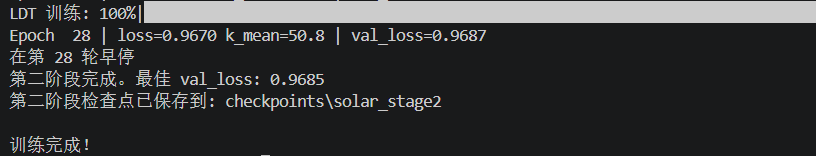

# 过程中遇到的问题

### 1、阶段1的disc趋于0速度过快


##### 解决方法：

```bash
问题明确了：判别器第5 epoch 就死透了，生成器拿不到对抗梯度，VAE 只学了模糊平均，后面的 LDT 自然全废。

我来做三件事修复它：

判别器加 R1 梯度惩罚 — 防止判别器过强
标签平滑 — 不让判别器完美收敛
分离 G/D 学习率 — D 用更低的学习率
```


### 2、阶段2的最佳val_loss居高不下


##### 解决方法：

```bash
总结：LDT loss 不下降的根因
问题	修复
梯度裁剪 max_norm=1.0 太激进	→ 5.0
扩散步嵌入 k 索引偏移（1起始→0起始没减1）	→ (k-1).long()
先前的 Stage 1 VAE 检查点还能用，只需重跑 Stage 2：


python scripts/train.py --config configs/solar.yaml --stage 2
正常情况 LDT val_loss 应该从 ~1.0 逐步降到 ~0.2-0.5 区间。如果 10 个 epoch 内 loss 还是纹丝不动，那就是模型容量不够（d_model 128→256 或加层数）。先跑起来看看效果。
```
==================================================
最终结果
==================================================
CRPS-sum: 0.6148 ± 0.2836
MSE:      9.138919e+02 ± 1.835705e+02

论文参考值（表 1）: CRPS-sum=0.253, MSE=770.0